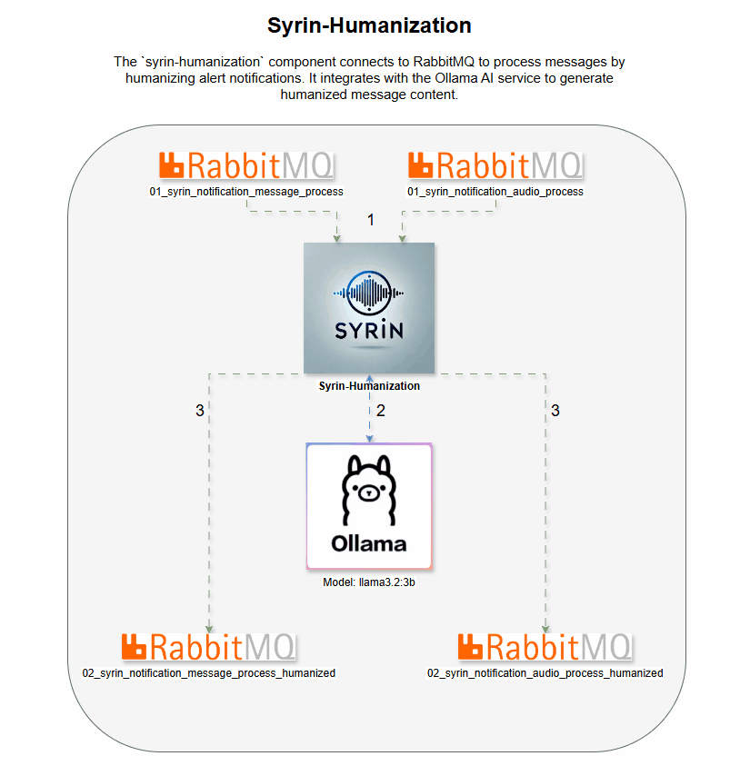

# syrin-humanization

The `syrin-humanization` component connects to RabbitMQ to process messages by humanizing alert notifications. It integrates with the Ollama AI service to generate humanized message content.

## Demo

## Table of Contents
- [Installation](#installation)
- [Environment Variables](#environment-variables)
- [Functionality](#functionality)
- [Queue Declarations](#queue-declarations)
- [Logging](#logging)
- [License](#license)

## Installation

Ensure that RabbitMQ and the Ollama AI service are configured and accessible. For full installation details, refer to the [SYRIN Installation Repository](https://github.com/syrin-alert/syrin-install).

## Environment Variables

Set the following environment variables for RabbitMQ and Ollama AI connection:

### RabbitMQ Settings

- `RABBITMQ_HOST`: RabbitMQ server address.
- `RABBITMQ_PORT`: Port for RabbitMQ server (default: `5672`).
- `RABBITMQ_VHOST`: Virtual host in RabbitMQ.
- `RABBITMQ_USER`: Username for RabbitMQ authentication.
- `RABBITMQ_PASS`: Password for RabbitMQ authentication.
- `RABBITMQ_TTL_DLX`: Time-to-live in ms for dead-letter queue (default: `60000`).

### Ollama AI Settings

- `OLLAMA_HOSTNAME`: Ollama AI hostname.
- `OLLAMA_MODEL`: Model to use for generating humanized text, e.g., `llama3.2:3b`.

### Custom Prompts

- `PROMPT_AUDIO`: Custom prompt for generating audio notification humanization.
- `PROMPT_MESSAGE`: Custom prompt for generating general message notification humanization.

## Functionality

This script performs the following tasks:

1. Connects to RabbitMQ and Ollama AI with the credentials from environment variables.
2. Ensures that required queues exist.
3. Continuously consumes messages from queues, humanizes the alert content using Ollama AI, and sends it to designated queues.

### Queue Declarations

The following queues are managed in RabbitMQ:

- `01_syrin_notification_audio_process`: Receives audio notification messages.
- `01_syrin_notification_message_process`: Receives general alert messages.
- `02_syrin_notification_audio_process_humanized`: Receives humanized audio alert messages.
- `02_syrin_notification_message_process_humanized`: Receives humanized general alert messages.
- `01_syrin_notification_message_reprocess` & `01_syrin_notification_audio_reprocess`: Reprocess queues for failed messages.

## Logging

Logging is set at the INFO level with `pika` logs set to WARNING for reduced verbosity.

## License

This project is licensed under the MIT License.