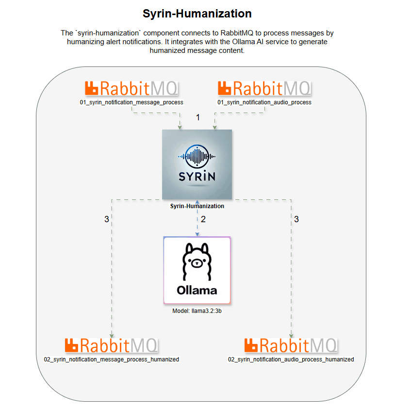

# syrin-humanization

O componente `syrin-humanization` conecta-se ao RabbitMQ para processar mensagens humanizando notificações de alerta. Ele integra-se ao serviço Ollama AI para gerar conteúdo de mensagens humanizadas.

## Demo

## Tabela de Conteúdos
- [Instalação](#instalação)
- [Variáveis de Ambiente](#variáveis-de-ambiente)
- [Funcionalidade](#funcionalidade)
- [Declarações de Filas](#declarações-de-filas)
- [Logs](#logs)
- [Licença](#licença)

## Instalação

Certifique-se de que o RabbitMQ e o serviço Ollama AI estejam configurados e acessíveis. Para detalhes completos de instalação, consulte o [Repositório de Instalação do SYRIN](https://github.com/syrin-alert/syrin-install).

## Variáveis de Ambiente

Defina as seguintes variáveis de ambiente para a conexão com o RabbitMQ e Ollama AI:

### Configurações do RabbitMQ

- `RABBITMQ_HOST`: Endereço do servidor RabbitMQ.
- `RABBITMQ_PORT`: Porta para o servidor RabbitMQ (padrão: `5672`).
- `RABBITMQ_VHOST`: Virtual host no RabbitMQ.
- `RABBITMQ_USER`: Nome de usuário para autenticação no RabbitMQ.
- `RABBITMQ_PASS`: Senha para autenticação no RabbitMQ.
- `RABBITMQ_TTL_DLX`: Tempo de vida em ms para a fila de dead-letter (padrão: `60000`).

### Configurações do Ollama AI

- `OLLAMA_HOSTNAME`: Hostname do Ollama AI.
- `OLLAMA_MODEL`: Modelo a ser usado para gerar texto humanizado, ex.: `llama3.2:3b`.

### Prompts Personalizados

- `PROMPT_AUDIO`: Prompt personalizado para humanização de notificações de áudio.
- `PROMPT_MESSAGE`: Prompt personalizado para humanização de notificações de mensagens gerais.

## Funcionalidade

Este script executa as seguintes tarefas:

1. Conecta-se ao RabbitMQ e ao Ollama AI com as credenciais das variáveis de ambiente.
2. Garante que as filas necessárias existam.
3. Consome mensagens continuamente, humaniza o conteúdo de alerta usando o Ollama AI e envia para as filas designadas.

### Declarações de Filas

As seguintes filas são gerenciadas no RabbitMQ:

- `01_syrin_notification_audio_process`: Recebe mensagens de notificações de áudio.
- `01_syrin_notification_message_process`: Recebe mensagens de alertas gerais.
- `02_syrin_notification_audio_process_humanized`: Recebe mensagens de alertas de áudio humanizadas.
- `02_syrin_notification_message_process_humanized`: Recebe mensagens de alertas gerais humanizadas.
- `01_syrin_notification_message_reprocess` & `01_syrin_notification_audio_reprocess`: Filas de reprocessamento para mensagens com falha.

## Logs

Os logs estão configurados no nível INFO e os logs da biblioteca `pika` são definidos para WARNING para reduzir a verbosidade.

## Licença

Este projeto está licenciado sob a Licença MIT.